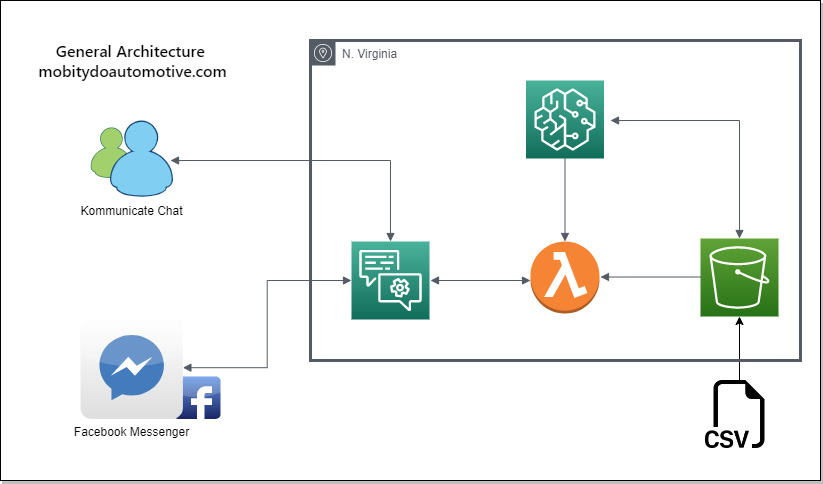

# www.mobitydoautomotive.com
## Project 2 : FINTECH Bootcamp UofT 2022

[www.mobitydoautomotive.com](https://www.mobitydoautomotive.com)

## Introduction 
...

## Architecture 
...

## Dataset and Resources
* Kaggle (main data source)
* Datahub
* Data.Gov
#### Resources used
* AWS - Lambda and Sagemaker
* Scikit-Learn ML linear regression used

## Presentation 
* [Slide Presentation](/Presentation/Project%20Presentation%20-%20Project%202.pdf) 
#### Slide Script

#### Project Presentation Script:
#### Slide 1 
-	We want to welcome everyone to our presentation Today. 
-	We are excited to be here, and we will be presenting our new ML learning algorithm to showcase our new EV Dealership, and answer the question … “Based on previous sales and popularity, what is the best Electronic Vehicle for each of our individual customers”
#### Slide 2
-	Our dealership – our company is called “mobitydo automotive” – which is an acronym for all of our first names.  Catchy right?
-	Our website is listed below the title, and later in the presentation we will be heading over there to showcase some of the ML features we put together.  But let’s hold off on that until we get there.
-	Right now I want to focus on our Core message, which is our forecast modeling and the API ChatBox we have utilized
-	 Our Core Message from a business perspective, is to serve our customers by providing them with the best options that tailor our inventory to fit their needs.  We do this by utilizing the very latest in ML Algorithm technology, and of course, our Interactive interface tech - I.E our ChatBot
-	For our ML Algorithm, we used an linear regression model that allows us to use historical data and predict the most popular model for our customers based on their needs
-	And then For our live 24/7 Chatbot we use an API called Kommunicate, to interact with our algorithm. Which helps guide our users towards the EV that suits their personal needs.
-	
#### Slide 3
From here I will pass it off to Dominique go to the website!

#### Slide 4
-	So just to summarize my counterparts, as trained Data Scientists we used a time-series auto-Regressive model to forecast the best choice for our customer.
-	Our Chatbot, helps us narrow down the search for the best possible choice for our customers.  All powered by AWS!!!
#### Slide 5
-	This is just a quick over view of what Mohammad.  
-	So first we gathered all our data required to build our algorithm built in Python and integrated that into SageMaker
-	We then Ran AWS Lambda as our serverless computing platform, which allowed us to run our code in response to events and automatically provides the computing resources needed by our code.
-	Lastly we utilized our API interface to interact with our customers
#### Slide 7 
-	We used Kaggle extensive to find our Data, lots of Google research to use for our ML algorithm
-	Our biggest challenges was the Data size, and lack of available free data.  We had to focus on larger markets as Canada was too small of a market.   Those were our biggest challenges
-	List of Resources used
-	Lambda AWS
-	SageMaker
-	An SK-learn
#### Slide 8
-	We attempted to run the Time series auto-regressive model but it was a good fit for projecting EV Sales.
-	So the answer to this was to use an linear regression model to base our results on existing data.  This made it much easier for us to determine popularity in the future based on popularity from the past
-	So in conclusion, we found it extremely challenging to forecast based on a limited data set.  With more time, experience, and extensive data we could have used the time series model.  However, we were successful using the historic data which allowed us to predict the best possible future purchase for our customers.
-	That leads us to What we could have done better?
-	As mentioned, better data based on a larger sample size– for instance time – EV’s have only been around for a limited period.  We also found that many sets were interrupted around the year 2019 for some reason (probably covid)
-	And of course, we are new here so, more experience with ML models, this was our first model, so we can only go up from here!
#### Slide 9
-	So, we have to ask…. How can we get you in an EV Today?
The floor is now open for questions…

## Files
* [Lex Bot](/Lex/)
* [Lambda function](/Lambda/)
* [SageMaker](/SageMaker/)
* [Lambda added layers](/Lambda_added_layers/)
* [Resources](/Resources/)
* [Presentation](/Presentation/Project%20Presentation%20-%20Project%202.pdf) 

## Team Members
* Bill Tang, billtang7@gmail.com, https://github.com/b-tank1
* Tyler Leonard, sambuilt@hotmail.com, https://github.com/Tyler-leo
* Mohammad Samadi, mj.samadi@gmail.com, https://github.com/mjsamadi
* Domenic Chiaromonte, chefdommm@gmail.com, https://github.com/chefdommm
